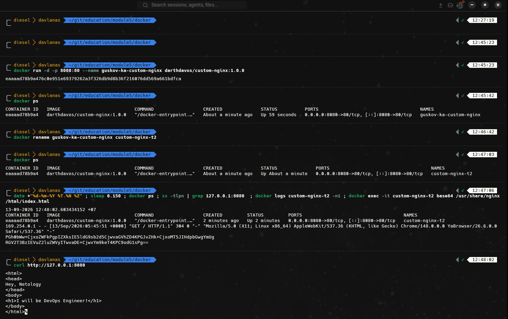
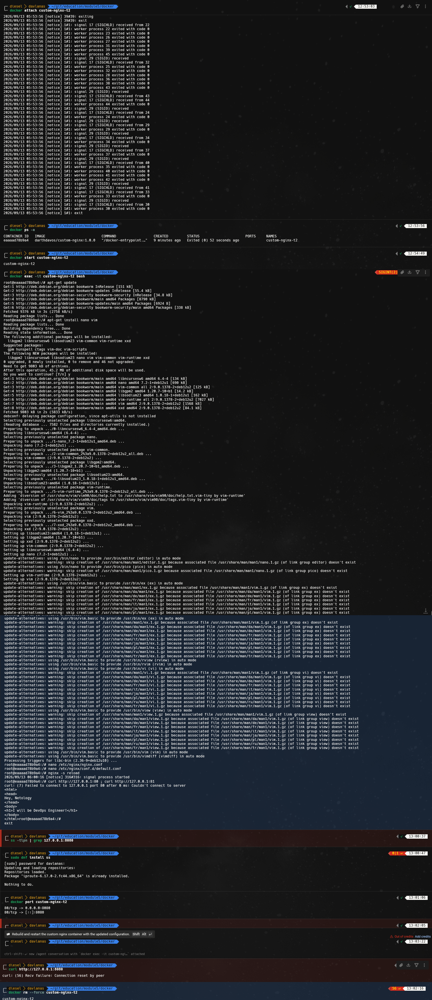
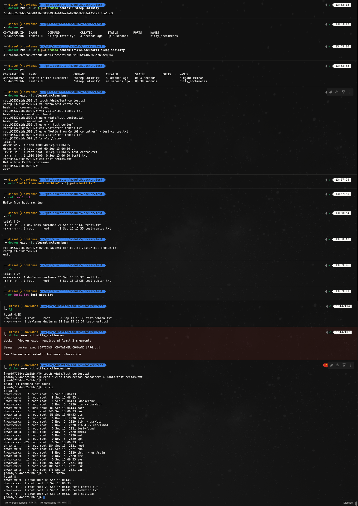
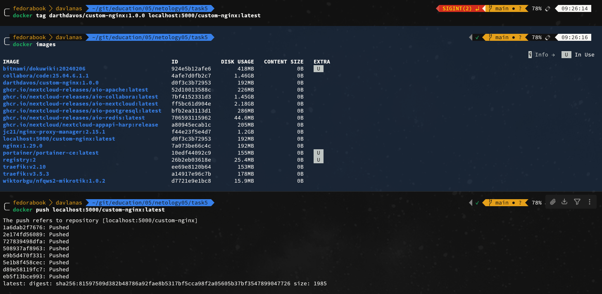
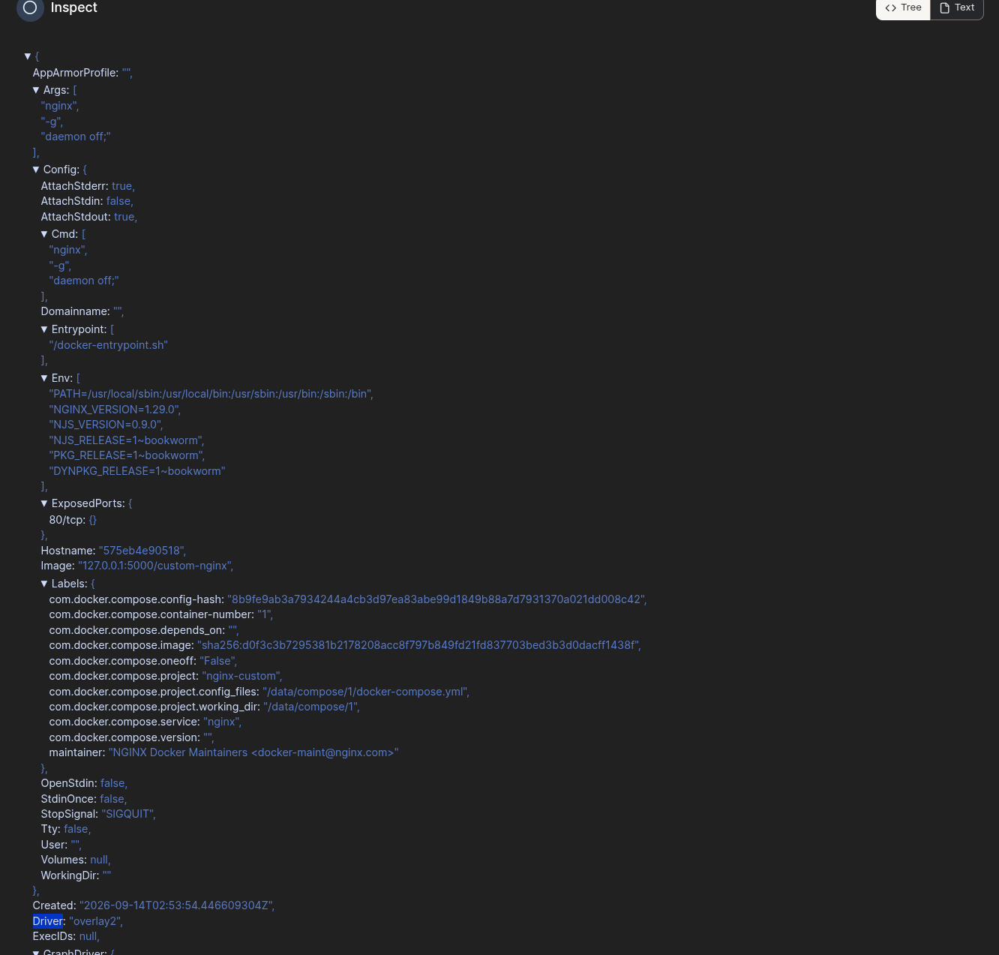
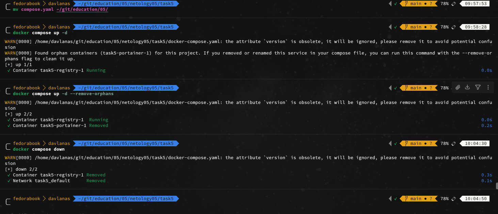
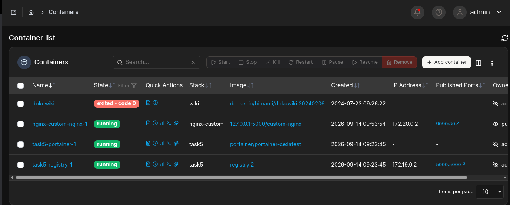
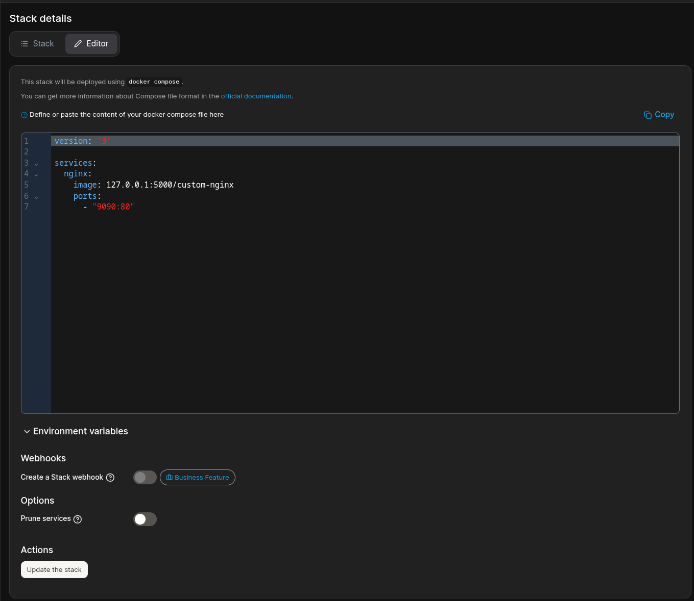

### 05-virt-03-docker-intro
## Задача 1
# Dockerfile
```
FROM nginx:1.29.0
COPY ./index.html /usr/share/nginx/html/index.html
```
# URL on my nginx-custom image
https://hub.docker.com/r/darthdavos/custom-nginx

## Задача 2



## Задача 3



При выполнении команды docker attach мы подключаемся к основному процессу в контейнере (в данном случае - nginx), когда мы нажимаем ctrl+c процессу передается sigkill или sigterm и процесс завершается. \
Т.к контейнер не работает, если не запущен основной процесс, то он завершается. 

При изменении listen c 80 на 81 мы изменили, прослушиваемый nginx порт, но в команде запуска у нас прописан проброс с 8080(хост) на 80(контейнер) следовательно после изменения порта в конфиге его никто не слушает. \
Отсюда и возникает проблема с доступом к странице.

## Задача 4



## Задача 5

1. Запускается файл compose.yaml, т.к основным (каноническим) именем считается compose.yaml (или compose.yml). \
Имя docker-compose.yaml поддерживается только для обратной совместимости со старыми версиями и используется лишь в том случае, если файла compose.yaml нет
2. 
```
version: "3"

include:
  - docker-compose.yaml
services:
  portainer:
    network_mode: host
    image: portainer/portainer-ce:latest
    volumes:
      - /var/run/docker.sock:/var/run/docker.sock
```
3. 


4. Настройку выполнил, токен для первоначальной найтройки нашел в логах portainer.

5. Компоуз добавил

6. 



7. 



Суть в том, что при удалении compose.yaml часть контейнеров "осиротела" о чем и говорит предупреждение. Как следствие компоуз предлагает удалить контейнеры, которые более не описаны в манифесте.





